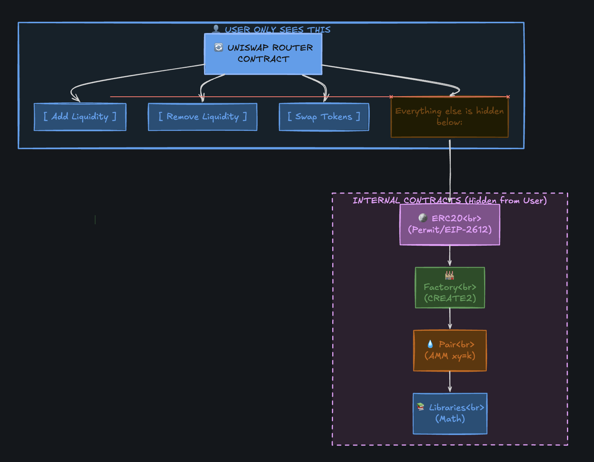
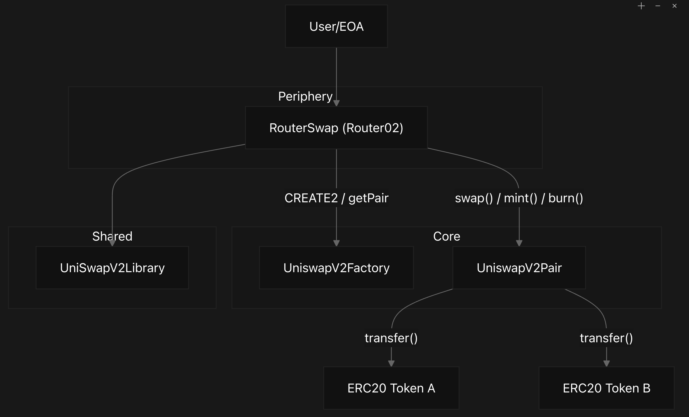
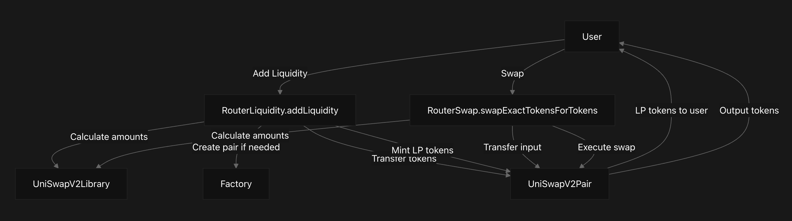
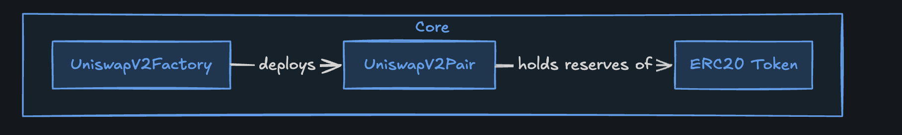
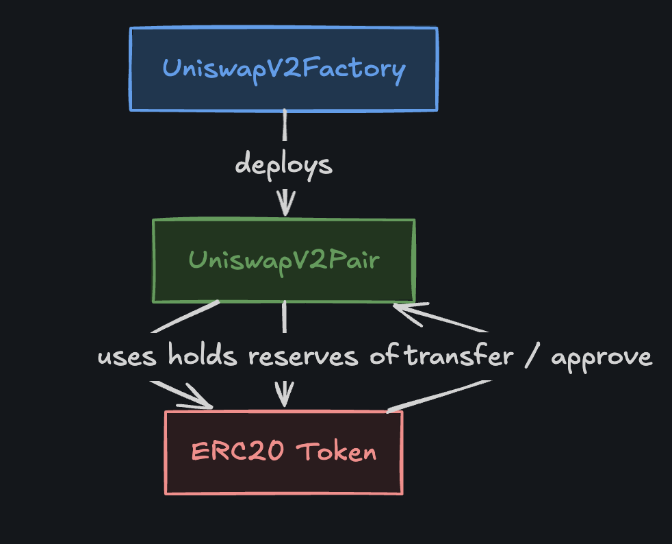
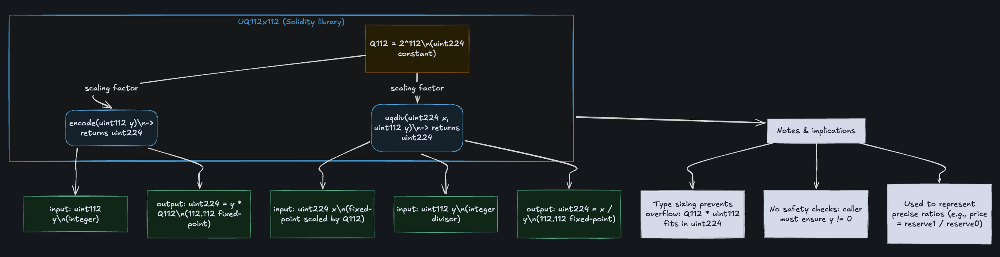
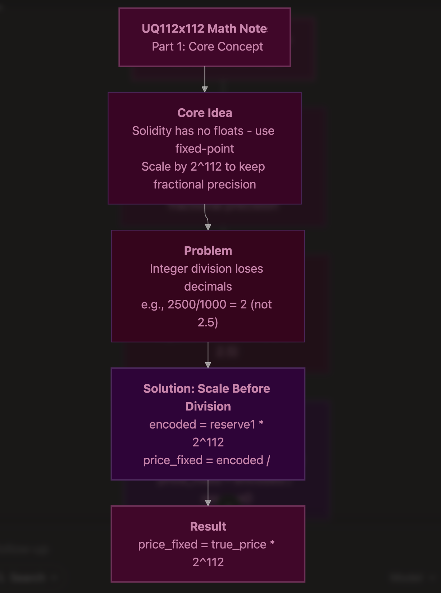
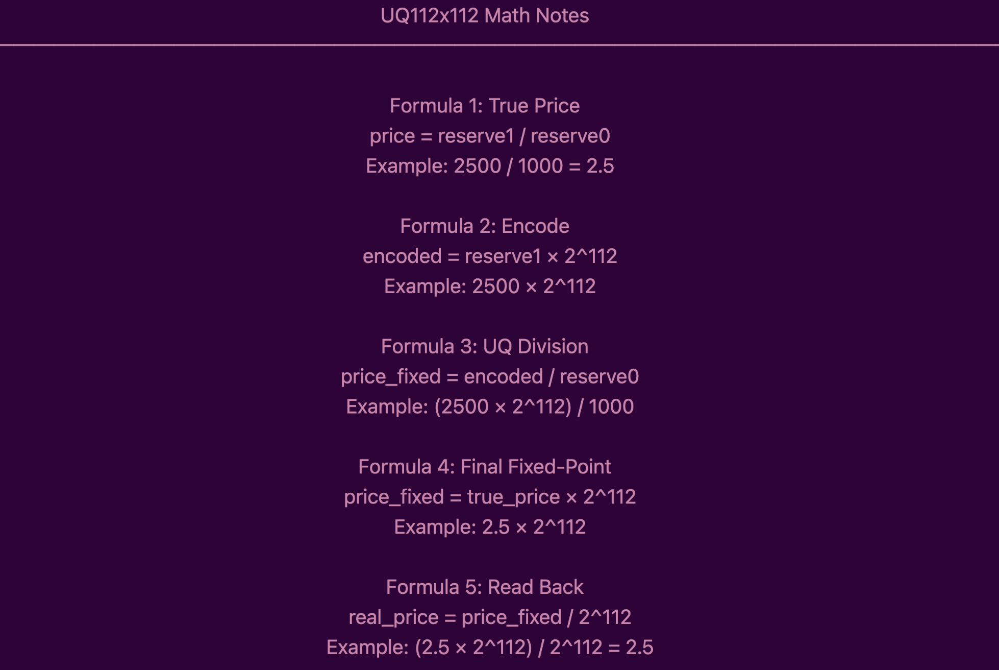

<div align="center">

# UniSwap V2

<p>
  <strong>A from-scratch Uniswap V2 style AMM implementation.</strong><br>
  Core pools, deterministic pair creation, LP tokens, swap routers, fee-on-transfer support, and reusable math libraries.
</p>

<p>
  <code>Core</code> · <code>Periphery</code> · <code>AMM</code> · <code>CREATE2</code> · <code>TWAP</code>
</p>


---

## Architecture Overview

> **Key idea:** Uniswap V2 separates the protocol into **core contracts** that protect pool funds and **periphery contracts** that make the protocol easier to use.



| Layer | Contract / Library | Role |
| --- | --- | --- |
| Core | `UniSwapV2ERC20` | LP token base contract with `permit` support |
| Core | `UniswapV2Pair` | Holds reserves, mints/burns liquidity, executes swaps |
| Core | `UniswapV2Factory` | Creates and tracks pair contracts with `CREATE2` |
| Periphery | `RouterLiquidity01` | Adds liquidity for token-token and token-ETH pools |
| Periphery | `RouterLiquidity02` | Removes liquidity, including permit-based removal |
| Periphery | `RouterSwap` | Swap router for normal ERC-20 and ETH swaps |
| Periphery | `RouterFeeOnTransfer` | Router support for taxed / fee-on-transfer tokens |
| Library | `UniSwapV2Library` | Pair address calculation, reserve reads, and AMM quote math |
| Library | `UQ112x112` | Fixed-point math for TWAP price accumulation |


---



## 1. What is Uniswap V2?

> Uniswap V2 is a decentralized exchange protocol that lets anyone swap any ERC-20 token pair directly on-chain, using an automated market maker (AMM) instead of an order book. Prices are set by a constant-product formula, not by centralized intermediaries.

In simple words, users trade against liquidity pools instead of waiting for a buyer or seller. The pool always follows:

```text
x * y = k
```

Where `x` and `y` are the token reserves, and `k` is the constant product that the pair protects during swaps.

[Read more](https://nansen.ai/post/what-is-uniswap-v2-architecture-pools-flash-swaps)

---

## 2.Order Book

# Order Book - Quant Intuition

> An order book is a list of buy and sell orders for a specific asset, organized by **time-price priority**. It answers: **who trades next, at what price, and for how much** when new orders arrive.

---

## PS5 Example: Intuition

GameStop is the only seller of PS5s, and many buyers quote the maximum price they are willing to pay.

- GameStop sells to the **highest bidder**.
- If multiple buyers are at that highest price, it fills them in the **order they arrived**.
- This is exactly how an order book works: **price decides the level**, and **time decides your queue position** at that level.

---

## Level 1 (L1): Best Bid / Ask

L1, or **level 1**, shows only the **best bid** and **best ask**. This is the top of the book.

| Term | Meaning |
| --- | --- |
| Best bid | Highest price someone is currently willing to buy |
| Best ask | Lowest price someone is currently willing to sell |
| Spread | Difference between best ask and best bid |

Example:

```text
Best bid = 100
Best ask = 110
Spread   = 10
```

This is called a **one-dimensional view** because you only see one price on each side.

---

## Level 2 (L2): Market by Price (MBP)

L2 extends beyond the best bid and ask to show **multiple price levels** on both sides.

For each price level, you see:

- Price
- Total aggregated quantity at that price
- Count of participants at that price

### Example Bids

| Price | Quantity | Participants |
| --- | ---: | ---: |
| 100 | 5 | 1 |
| 90 | 10 | 2 |

### Example Asks

| Price | Quantity | Participants |
| --- | ---: | ---: |
| 110 | 5 | 2 |
| 120 | 1 | 1 |

You see **depth and total size per price**, but not individual orders.

---

## Level 3 (L3): Market by Order (MBO)

L3 breaks each L2 level into **individual orders**.

For each order, you see:

- Order identifier
- Quantity
- Queue position at that price

Example at ask `110`, where total quantity is `5` and there are `2` participants:

| Order | Side | Quantity | Queue Position |
| --- | --- | ---: | --- |
| A | Sell | 3 units | Arrived earlier |
| B | Sell | 2 units | Arrived later |

Total quantity is still `5`, but L3 exposes **3 vs 2** and shows which order is ahead in the queue.

---

## Time-Price Priority (FIFO)

Most markets use **time-price priority**, often called **FIFO**: first in, first out.

> Better price wins across levels. Within the same price, earlier orders are filled first.

Example fill at ask `110`:

```text
Resting orders:
A = 3 units
B = 2 units
Total = 5

New aggressive buy:
1 unit at 110

Fill:
1 unit comes from A
A goes from 3 -> 2
Level total goes from 5 -> 4
```

Exchanges often give each order an ID that encodes its queue priority, so you can track where you are in line and how fills evolve over time.

---

## Pro-Rata Allocation

**Pro-rata** is another queueing algorithm where priority at a given price depends on **size**, not arrival time.

### PS5 Example

| Buyer | Arrival | Wants | Price |
| --- | --- | ---: | ---: |
| You | 8 hours before launch | 1 PS5 | 300 |
| Another buyer | 1 minute before launch | 10 PS5s | 300 |

Under pro-rata, the larger `10` unit buyer is served first, or gets a larger share, despite arriving later.

This encourages traders to quote **large size** to move to the front of the queue. That is why in some treasury markets you see big displayed quantities at the best prices.

---

## Short Mental Model

| View | What You See | What You Do Not See |
| --- | --- | --- |
| L1 | Best bid and best ask | Depth behind the top price |
| L2 | Price levels and total size | Individual orders |
| L3 | Individual orders and queue position | Nothing hidden inside each shown level |

**Price chooses the level. Time or size chooses the queue.**


https://www.highcharts.com/demo/stock/orderbook-chart

## 3. Order Book vs AMM

**Order book exchanges** match buyers and sellers, so you need someone on the other side of your trade. **AMMs** like Uniswap V2 use liquidity pools, so you always trade against a pool of tokens, and prices update automatically with each swap.

For example, buying ETH with USDC on Uniswap means you interact with a pool, not a specific seller.

[More details](https://docs.polkadot.com/smart-contracts/cookbook/eth-dapps/uniswap-v2/)

---




## 4. UniswapV2ERC20 (LP Token)

When you add liquidity to a Uniswap V2 pool, you get LP (liquidity provider) tokens. These represent your share of the pool. When you remove liquidity, your LP tokens are burned and you get your tokens back.

Only the pair contract can mint or burn LP tokens. This prevents abuse and ensures the math stays correct.

**Main responsibilities**

- Track LP balances and total supply
- Support ERC-20 transfers and approvals
- Support EIP-2612 `permit`
- Emit standard `Transfer` and `Approval` events

[Learn more](https://jeiwan.net/posts/programming-defi-uniswapv2-1/) | [rareskills](https://rareskills.io/post/uniswap-v2-tutorial)

---

## 5. UniswapV2Pair

This is the smart contract that holds two ERC-20 tokens, tracks their reserves, and enforces the constant-product rule for swaps. It also mints/burns LP tokens and charges a small fee on each swap.

> **Important:** Keeping reserves in sync with actual balances is crucial. If reserves and balances drift incorrectly, attackers can exploit the pool.

**Main responsibilities**

- Store `token0`, `token1`, `reserve0`, and `reserve1`
- Mint LP tokens when liquidity is added
- Burn LP tokens when liquidity is removed
- Execute swaps while preserving the AMM invariant
- Accumulate prices for TWAP oracle usage

[More theory](https://jeiwan.net/posts/programming-defi-uniswapv2-1/) | [rareskills](https://rareskills.io/post/uniswap-v2-tutorial)

---

## 6. UniswapV2Factory

The factory contract creates new pair contracts for each token pair and keeps a registry of all pairs. It ensures each pair is unique and uses `CREATE2` for deterministic addresses.

The router and library can calculate the pair address before interacting with it, which makes swaps and liquidity operations more efficient.

**Main responsibilities**

- Create pairs only once per token pair
- Store pair addresses in both token orders
- Track all deployed pairs
- Manage protocol fee settings through `feeTo`

[Binance blog](https://www.binance.com/en/square/post/18909021788401)

---



## 7. RouterLiquidity01 (Add Liquidity Router)

`RouterLiquidity01` is the periphery contract for adding liquidity. Users approve tokens to the router, and the router calculates the optimal token amounts before transferring assets into the pair and minting LP tokens.

> **Key takeaway:** Adding liquidity means depositing two assets in the correct pool ratio, then receiving LP tokens that represent your share of the pool.

**Supported liquidity flows**

- `addLiquidity`
- `addLiquidityETH`
- `_addLiquidity`

**How it works**

- Creates the pair if it does not exist
- Reads current reserves from the pair
- Calculates the optimal token ratio using `quote`
- Transfers tokens into the pair
- Calls `mint` on the pair to issue LP tokens

[Uniswap V2 Router docs](https://docs.uniswap.org/contracts/v2/reference/smart-contracts/router-02#addliquidity)

---

## 8. RouterLiquidity02 (Remove Liquidity Router)

`RouterLiquidity02` is the periphery contract for removing liquidity. Users transfer LP tokens back to the pair, the pair burns those LP tokens, and the user receives their proportional share of both pool assets.

> **Key takeaway:** Removing liquidity burns LP tokens and returns the underlying reserves back to the liquidity provider.

**Supported removal flows**

- `removeLiquidity`
- `removeLiquidityETH`
- `removeLiquidityWithPermit`
- `removeLiquidityETHWithPermit`

**Why permit matters**

Permit lets users approve LP token spending with a signature instead of sending a separate approval transaction. This can save gas and make the remove-liquidity flow smoother.

[Uniswap V2 Router docs](https://docs.uniswap.org/contracts/v2/reference/smart-contracts/router-02#removeliquidity)

---

## 9. RouterSwap (Swap Router)

The swap router is the user-facing periphery contract for normal token swaps. Users approve tokens to the router, then the router calculates input/output amounts through the library, transfers tokens into the first pair, and calls each pair along the swap path.

> **Key takeaway:** The router improves user experience, but the pair contract still protects the real AMM invariant.

**Supported swap flows**

- `swapExactTokensForTokens`
- `swapTokensForExactTokens`
- `swapExactETHForTokens`
- `swapTokensForExactETH`
- `swapExactTokensForETH`
- `swapETHForExactTokens`

[Uniswap V2 Router docs](https://docs.uniswap.org/contracts/v2/reference/smart-contracts/router-02)

---

## 10. RouterFeeOnTransfer

Some ERC-20 tokens take a fee whenever they are transferred, so the amount sent is not always the amount received by the pair. The fee-on-transfer router solves this by checking the pair's actual token balance after transfer, then calculating the output from the real amount that arrived.

> **Key takeaway:** Standard swap logic assumes the pair receives the full input amount. Fee-on-transfer tokens break that assumption, so this router measures the real input before swapping.

**Why this matters**

- Taxed tokens may burn or redirect part of each transfer
- The pair may receive less than the router expected
- Standard swaps can fail because the invariant check sees less input
- Supporting functions compute output from the actual received balance

[Router02 fee-on-transfer functions](https://docs.uniswap.org/contracts/v2/reference/smart-contracts/router-02#swapexacttokensfortokenssupportingfeeontransfertokens) | [Zealynx Router FOT](https://academy.zealynx.io/modules/uniswap-v2/router-fot)

---

## 11. UniSwapV2Library

The library keeps common AMM math and address logic outside the router contracts. It sorts token addresses, calculates deterministic pair addresses with `CREATE2`, reads reserves in the right token order, quotes prices, and calculates swap amounts.

**Main helpers**

- `sortTokens`
- `pairFor`
- `getReserves`
- `quote`
- `getAmountOut`
- `getAmountIn`
- `getAmountsOut`
- `getAmountsIn`

[Uniswap V2 library reference](https://docs.uniswap.org/contracts/v2/reference/smart-contracts/library)

---

## 12. UQ112x112 Library





`UQ112x112` is a fixed-point math library used by the pair contract for price accumulation. Solidity does not support floating-point numbers, so Uniswap V2 stores prices using fixed-point integers.

This helps the pair track time-weighted average prices (TWAPs), which can be used by oracle systems.

```text
encoded price = reserveB / reserveA
TWAP          = price cumulative delta / time elapsed
```

[TWAP explanation](https://docs.uniswap.org/contracts/v2/concepts/core-concepts/oracles)

---

## References

- [Architecture overview reference](https://deepwiki.com/pranaykargam/UniSwap-V2/1.1-architecture-overview)
- [Router fee-on-transfer reference](https://academy.zealynx.io/modules/uniswap-v2/router-fot)
- [Uniswap V2 Router02 docs](https://docs.uniswap.org/contracts/v2/reference/smart-contracts/router-02)
- [Uniswap V2 Library docs](https://docs.uniswap.org/contracts/v2/reference/smart-contracts/library)

---

<div align="center">

## Connect

<p>
  <a href="https://x.com/pranaykargam">
    
  </a>
  <a href="https://www.linkedin.com/in/sunny-eth-58ba22283/">
    
  </a>
  <a href="https://discord.com/channels/810916927919620096/810916927919620099">
    
  </a>
  <a href="https://github.com/pranaykargam?tab=repositories">
    
  </a>
</p>

<p>
  Built with Solidity, Foundry, and curiosity.
</p>

</div>
